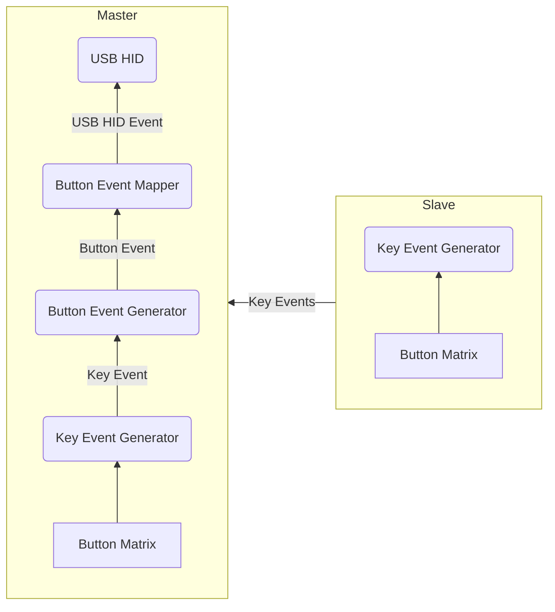

# Kallisto

A custom split keyboard, with custom electronics and firmware.

The hardware is based around a variant of the _Raspberry Pi Pico_ board, and the _RP2040_ microcontroller.
The keyboard features:

- 42 Kailh 1350 mechanical keyswitches (21 per half), 4 extra buttons and one rotary encoder.
- Fully programmable key-map were any key can be mapped to any key/media function.
- Key-map Layers
- Custom RGB lighting with adjustable brightness
- Onboard flash memory that hold the key-map.

All electronics were designed using KiCad, and all firmware is written in Rust.

## Key Mapping
Any physical key on the keyboard may be mapped to any key, with or without an additional modifier.
Buttons have a few different press modes, similar to the *QMK* firmware, that you can map separatley to different keys.

The different key press types/events are:
- Press
- Held Press
- Double Press

### Held Press
A held press is when a button is pressed and held, for a set ammount of time (0.5s by default).
If a button has a held press mapping is pressed and then released before the held-time window,
then the regular _Press_ mapping while fire upon the release, not the press.
If another button is pressed before the end of the held-time window, then the held press mapping while fire immediatley,
and the other pressed button will fire right after.
If a button with a held press mapping is pressed and held for more than the held-time window, and no other button is pressed in between,
then the held press key mapping will fire.

## Software Design
The right half of the keyboard connected to the host PC acts as the master, and the the left half as the slave.
Compiling the embedded software will generate two separate binaries, one for the master half, and one for the slave.
The slave software is very light-weight and is basically only reading the button matrix, and communicating the current
button states to the master half vi I2C. This means that the slave, once flashed, should rarely need to be re-programmed since the
vast majority of the more complicated application code is running on the master half.
Below is a figure showing the overall architecture of the software that is running on each half of the keyboard.

### Key Event Generator
The `Key Event Generator` reads the current states of all keyboard buttons from the button matrix driver, and generates key press events.
Either key-down or key-up events, based on the current, and the previous button states. Key press events and IDs are constantly
streamed from the slave to the master half via I2C.
These key events from both halves are then queued on the master, along with a unique button ID for which physical button that triggered the event.

### Button Event Generator
The `Button Event Generator` then reads the incoming key press events, and correspoding button IDs from the key-event queue.
This information is then used to generate `Button Events`. The different kinds are:
- Single Press
- Held Press
- Double Press

A held press is triggered if a button is pressed and held for more than 0.3 seconds, and a double press is generated
if a button is pressed twice within 0.3 seconds (these times are tweakable).

The button events along with the ID of which physical button produced the event are then passed `Button Event Mapper`

### Button Event Mapper
The `Button Event Mapper` then maps the incoming button IDs and button event types to a key-press to be sent to the host PC via USB.
For example, single pressing the z-key might map to `z`, but pressing and hold it might map to `Ctrl`. This mapping for each physical button,
and button event type is fully customizable.

